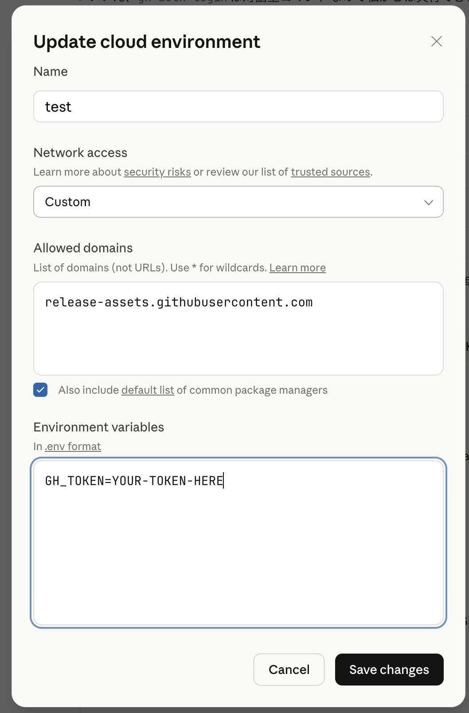

# gh-setup-hooks

[](https://www.npmjs.com/package/gh-setup-hooks)
[](LICENSE)

Auto-install GitHub CLI on Claude Code on the Web. **Just add one line to settings.json.**

## Setup

### 1. Add hook to settings.json

Add to `.claude/settings.json`:

```json
{
  "hooks": {
    "SessionStart": [
      {
        "hooks": [
          {
            "type": "command",
            "command": "bunx -y gh-setup-hooks",
            "timeout": 120
          }
        ]
      }
    ]
  }
}
```

`npx -y gh-setup-hooks` is also ok.

### 2. Set up Claude Code on the Web

To use `gh` commands (e.g., `gh pr create`), you need to set `GH_TOKEN` or `GITHUB_TOKEN`:

1. Go to [Claude Code on the Web](https://claude.ai/code)
2. Open **Settings** → **Custom Environment**
3. Add environment variable:
   - Name: `GH_TOKEN` or `GITHUB_TOKEN`
   - Value: Your [GitHub Personal Access Token](https://github.com/settings/tokens)

> **Note**: The token needs `repo` scope for most operations.

Claude Code on the Web network should be **Full** or **Custom**. If using **Custom**, you need to allow `release-assets.githubusercontent.com`.



## How It Works

1. Start a session on Claude Code on the Web
2. SessionStart hook runs `npx gh-setup-hooks`
3. Installs gh only in remote environment (`CLAUDE_CODE_REMOTE=true`)
4. Installs to `~/.local/bin` and persists PATH
5. Does nothing in local environment

## Configuration

| Environment Variable | Description | Default |
|---------------------|-------------|---------|
| `GH_SETUP_VERSION` | gh version to install | `2.83.2` |

## License

MIT

## References

- [npm package](https://www.npmjs.com/package/gh-setup-hooks)
- [GitHub CLI](https://cli.github.com/)
- [Claude Code Hooks](https://code.claude.com/docs/en/hooks)
- [GitHub Personal Access Tokens](https://github.com/settings/tokens)
